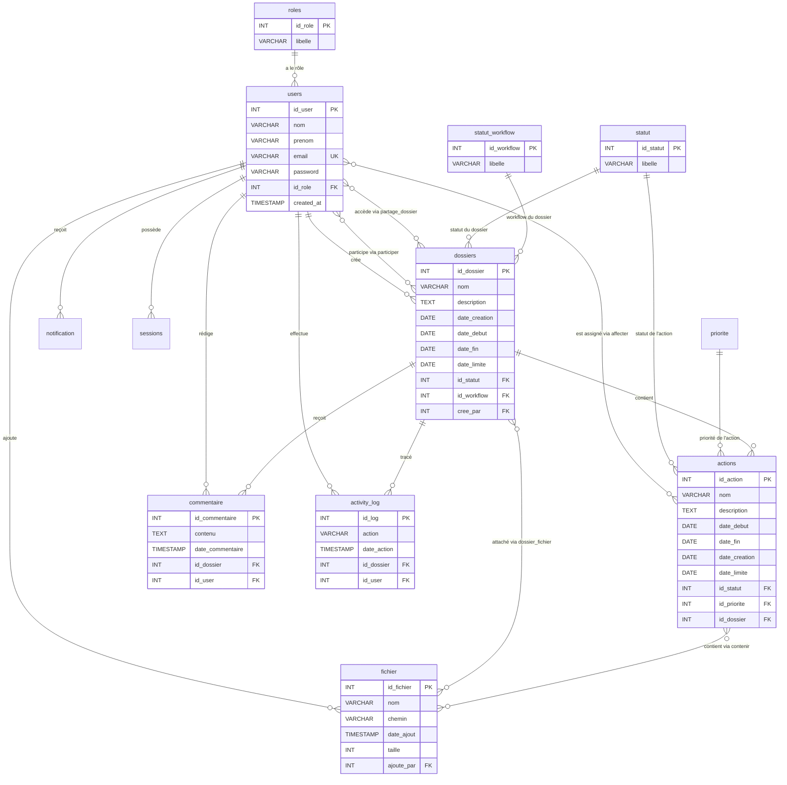
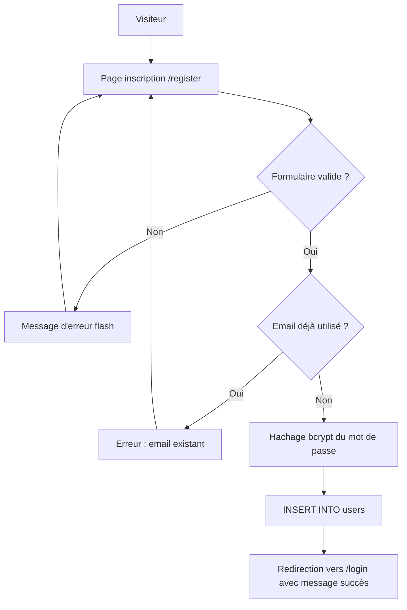
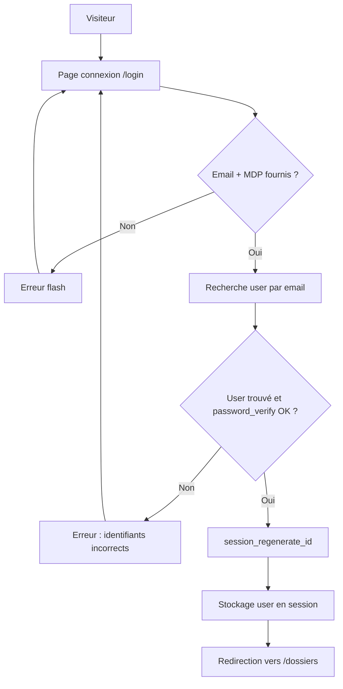
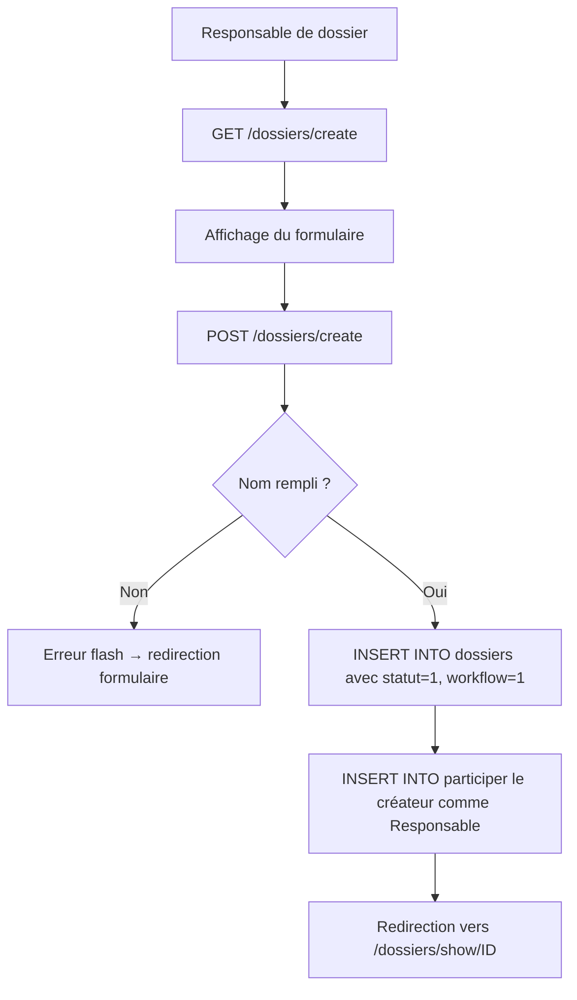
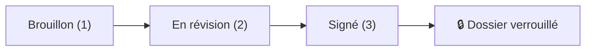
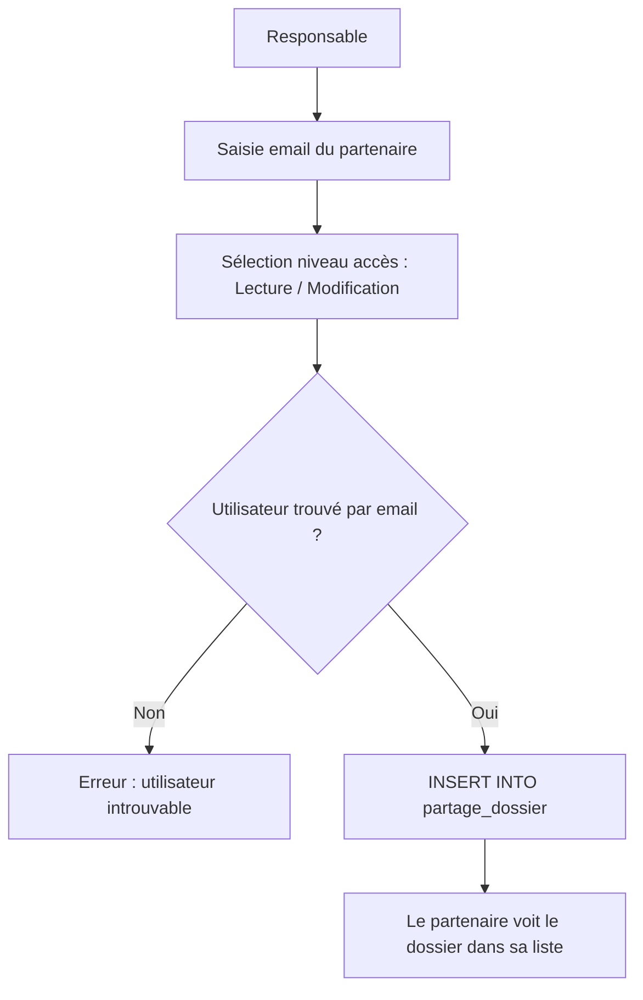
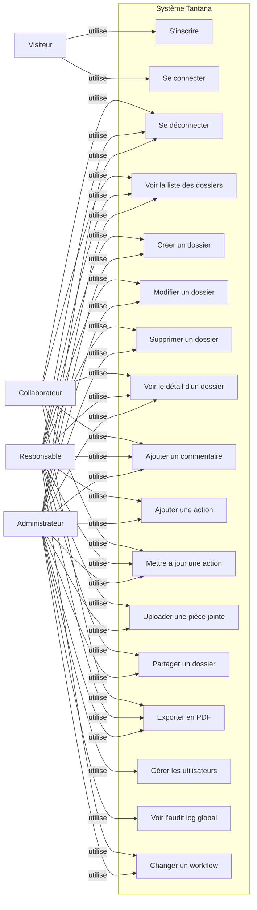
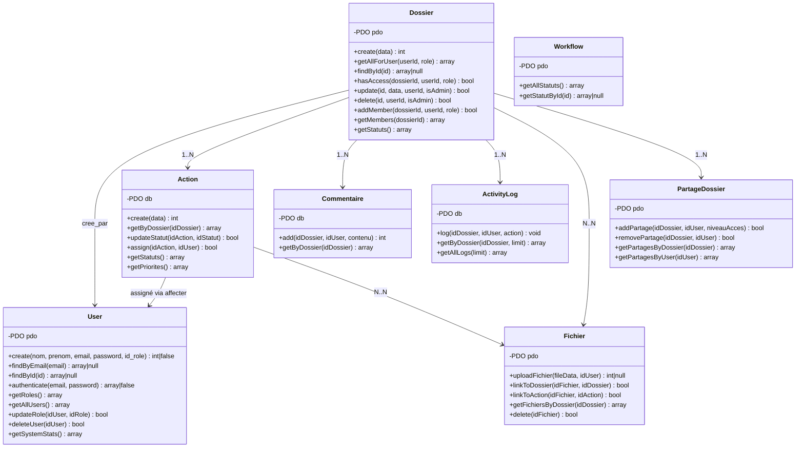
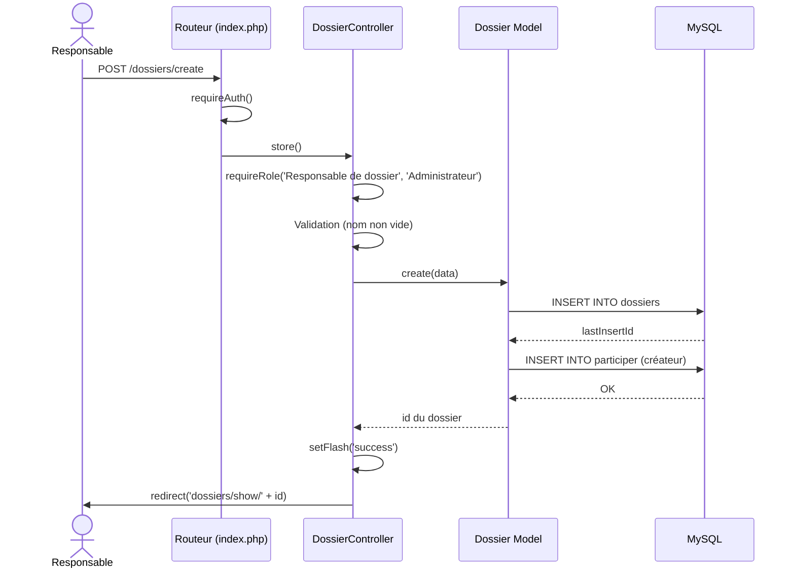

# PROJECT_CONTEXT.md — Tantana

> **Date de génération** : 8 août 2026
> **Méthode** : Analyse exhaustive du code source, de la base de données, de la configuration, des vues, de la documentation et de l'historique Git.
> **Avertissement** : Ce document est la source de vérité du projet. Toute information est issue du code réel analysé. Les déductions sont explicitement signalées.

---

## Table des matières

1. [Analyse globale du projet](#1-analyse-globale-du-projet)
2. [Arborescence du projet](#2-arborescence-du-projet)
3. [Stack technique](#3-stack-technique)
4. [Architecture logicielle](#4-architecture-logicielle)
5. [Fonctionnalités](#5-fonctionnalités)
6. [Utilisateurs, acteurs et rôles](#6-utilisateurs-acteurs-et-rôles)
7. [Authentification et sécurité](#7-authentification-et-sécurité)
8. [Base de données](#8-base-de-données)
9. [Modèle métier](#9-modèle-métier)
10. [Flux principaux](#10-flux-principaux)
11. [Routes / Endpoints](#11-routes--endpoints)
12. [Frontend / Interface](#12-frontend--interface)
13. [Backend](#13-backend)
14. [Dépendances entre composants](#14-dépendances-entre-composants)
15. [Configuration et environnement](#15-configuration-et-environnement)
16. [Installation et exécution](#16-installation-et-exécution)
17. [Tests](#17-tests)
18. [État actuel du projet](#18-état-actuel-du-projet)
19. [Git et historique](#19-git-et-historique)
20. [Choix techniques](#20-choix-techniques)
21. [Scénarios d'utilisation](#21-scénarios-dutilisation)
22. [UML et diagrammes](#22-uml-et-diagrammes)
23. [Glossaire](#23-glossaire)
24. [AI Handoff — Instructions pour une future IA](#24-ai-handoff--instructions-pour-une-future-ia)
25. [Résumé final](#25-résumé-final)

---

# 1. Analyse globale du projet

## 1.1 Identification

| Attribut | Valeur |
|---|---|
| **Nom** | Tantana |
| **Objectif principal** | Plateforme web de gestion de dossiers diplomatiques |
| **Problème résolu** | Centralisation, suivi et sécurisation des dossiers d'État (accords, résolutions, pièces jointes) entre ministères, ambassades et partenaires |
| **Contexte d'utilisation** | Organisations étatiques, ministères, ambassades, organismes internationaux (contexte malgache d'après les données de test) |
| **Utilisateurs ciblés** | Responsables de dossiers diplomatiques, collaborateurs, administrateurs système |
| **Valeur apportée** | Centralisation documentaire, workflow d'approbation formalisé (Brouillon → Révision → Signé), traçabilité des actions, partage sécurisé inter-organisationnel |
| **État actuel** | MVP fonctionnel sur la branche `architecture/new-cdm` |
| **Auteur** | Ismaël Andrimalala |

## 1.2 Résumé en 5 lignes (Niveau 1)

Tantana est une application web PHP/MySQL de gestion de dossiers diplomatiques. Elle permet de créer des dossiers de politique, d'y attacher des pièces jointes, d'assigner des actions aux collaborateurs et de suivre un workflow d'approbation formalisé (Brouillon → En révision → Signé). L'application gère trois rôles (Collaborateur, Responsable de dossier, Administrateur) avec un contrôle d'accès granulaire. Elle inclut un système de commentaires, un fil d'activité (audit log) et un export PDF. Le panneau d'administration permet la gestion centralisée des utilisateurs et la supervision globale de la plateforme.

## 1.3 Explication générale (Niveau 2)

Tantana fonctionne comme un système centralisé de gestion documentaire diplomatique. Les **Responsables de dossier** créent des dossiers de politique (ex : « Accord Bilatéral Madagascar-Maurice ») avec des échéances, y ajoutent des pièces jointes (PDF, documents), créent des actions/tâches et les assignent à des collaborateurs. Chaque dossier suit un **workflow d'approbation** en trois étapes : Brouillon → En révision → Signé. Une fois signé, le dossier est **verrouillé** : aucune modification, commentaire, action ou pièce jointe ne peut être ajouté.

Les **Collaborateurs** consultent les dossiers auxquels ils participent ou qui leur ont été partagés, et peuvent commenter et mettre à jour le statut des actions qui leur sont assignées. Les **Administrateurs** supervisent l'ensemble de la plateforme : gestion des utilisateurs, attribution des rôles, et consultation de l'audit log global.

Le système de **partage sécurisé** permet de donner accès à un dossier à un utilisateur externe avec un niveau d'accès spécifique (Lecture ou Modification). Un **fil d'activité** trace toutes les actions effectuées sur chaque dossier.

## 1.4 Explication technique (Niveau 3)

L'application est construite en **PHP 8.1+ natif** (sans framework) suivant une architecture **MVC manuelle**. Le point d'entrée unique est `public/index.php` qui implémente un routeur basé sur l'analyse des segments d'URL. Les sessions sont stockées en base de données MySQL via un handler personnalisé (`DbSessionsHandler`) implémentant `SessionHandlerInterface`.

La couche **Modèle** communique avec MySQL via PDO avec des requêtes préparées. La couche **Vue** utilise des templates PHP natifs avec Tailwind CSS (via CDN) et des classes CSS personnalisées. L'application n'utilise aucun gestionnaire de dépendances (pas de Composer), aucun ORM, et aucune bibliothèque externe côté serveur.

Le contrôle d'accès est implémenté via des fonctions helper globales (`requireAuth()`, `requireRole()`) appelées dans chaque contrôleur. L'accès aux dossiers est vérifié via la méthode `hasAccess()` du modèle `Dossier` qui contrôle si l'utilisateur est créateur, participant ou bénéficiaire d'un partage.

---

# 2. Arborescence du projet

```text
tantana/
├── config/
│   ├── database.php              # Configuration BDD, chargement .env, singleton PDO
│   └── DbSessionsHandler.php     # Handler de sessions en BDD (SessionHandlerInterface)
├── controllers/
│   ├── AuthController.php        # Connexion, inscription, déconnexion
│   ├── AdminController.php       # Console d'administration (rôle Administrateur)
│   └── DossierController.php     # CRUD dossiers, upload, partage, commentaires, actions, export
├── models/
│   ├── User.php                  # Modèle utilisateur (CRUD, authentification, rôles, stats)
│   ├── Dossier.php               # Modèle dossier (CRUD, membres, accès, statuts)
│   ├── Action.php                # Modèle action/tâche (CRUD, assignation, statuts, priorités)
│   ├── ActivityLog.php           # Modèle journal d'activité (log, consultation)
│   ├── Commentaire.php           # Modèle commentaire (ajout, consultation par dossier)
│   ├── Fichier.php               # Modèle fichier/pièce jointe (upload, liaison dossier/action)
│   ├── PartageDossier.php        # Modèle partage de dossier (ajout, suppression, consultation)
│   └── Workflow.php              # Modèle workflow d'approbation (statuts workflow)
├── public/
│   ├── index.php                 # Point d'entrée unique, routeur, helpers globaux
│   ├── .htaccess                 # Réécriture d'URL Apache
│   ├── img/                      # Images statiques de l'application
│   │   ├── diplomatic_seal.jpg   # Sceau diplomatique (page d'accueil, login)
│   │   ├── diplomatic_summit.jpg # Sommet diplomatique (tableau de bord)
│   │   ├── diplomatic_building.jpg # Palais diplomatique (inscription)
│   │   ├── diplomatic_desk.jpg   # Bureau diplomatique (état vide)
│   │   └── signed_treaty.jpg     # Traité signé (login, création/édition)
│   └── uploads/                  # Répertoire des pièces jointes uploadées (vide à l'initialisation)
├── views/
│   ├── home.php                  # Page d'accueil / landing page (visiteurs non connectés)
│   ├── auth/
│   │   ├── login.php             # Formulaire de connexion
│   │   └── register.php          # Formulaire d'inscription
│   ├── dossiers/
│   │   ├── index.php             # Liste des dossiers (tableau de bord)
│   │   ├── create.php            # Formulaire de création de dossier
│   │   ├── edit.php              # Formulaire de modification de dossier
│   │   ├── show.php              # Vue détaillée d'un dossier (actions, commentaires, fichiers, partages, audit)
│   │   └── pdf.php               # Vue d'export PDF (impression via window.print())
│   └── partials/
│       ├── header.php            # En-tête HTML, meta, CSS, Tailwind config, design system
│       ├── navbar.php            # Barre de navigation (conditionnelle selon le rôle)
│       ├── flash.php             # Messages flash (succès/erreur)
│       ├── footer.php            # Pied de page, auto-dismiss des flash messages
│       └── 404.php               # Page d'erreur 404
├── tests/
│   └── run_tests.php             # Suite de tests automatisés natifs (avec rollback transactionnel)
├── docs/
│   ├── TECHNICAL_GUIDE.md        # Guide technique (gitignore, local uniquement)
│   ├── changelog.md              # Journal des modifications détaillé jour par jour
│   ├── modifications.md          # Liste des modifications requises pour le MVP
│   ├── calendrier_developpement.md # Calendrier de développement sur 2 semaines
│   └── agenda_feature_spec.md    # Spécification de fonctionnalité agenda
│   └── new-cdm.png               # Image du nouveau CDM (Conception de Données)
├── tantana_new.sql               # Schéma SQL complet de la base de données
├── migrate_to_dossier.sql        # Script de migration : renommage projet→dossier, tache→action
├── migrate_to_dossier.sh         # Script shell de migration des fichiers et du code
├── .env                          # Variables d'environnement (gitignore)
├── .env.example                  # Template des variables d'environnement
├── .gitignore                    # Fichiers ignorés par Git
├── README.md                     # Documentation du projet
├── contexte_tantana.md           # Document de contexte existant (gitignore)
└── hihi.txt                      # Notes de test manuelles avec identifiants de test (gitignore)
```

| Répertoire / Fichier | Rôle |
|---|---|
| `config/` | Configuration de la connexion BDD et gestion des sessions |
| `controllers/` | Logique de traitement des requêtes HTTP (couche Controller du MVC) |
| `models/` | Accès aux données via PDO, logique métier (couche Model du MVC) |
| `public/` | Point d'entrée web, assets statiques, fichiers uploadés |
| `views/` | Templates PHP d'affichage (couche View du MVC) |
| `tests/` | Tests automatisés |
| `docs/` | Documentation technique et changelog |
| `tantana_new.sql` | Schéma SQL complet pour initialiser la BDD |
| `migrate_to_dossier.*` | Scripts de migration de la nomenclature « projet/tâche » vers « dossier/action » |

---

# 3. Stack technique

| Technologie | Version | Utilisation | Raison d'utilisation | Interactions |
|---|---|---|---|---|
| **PHP** | 8.1+ (natif, sans framework) | Backend complet : routage, contrôleurs, modèles, vues | Simplicité, pas de dépendance externe, adapté à un MVP académique | Interagit avec MySQL via PDO |
| **MySQL** | 8.0+ | SGBD relationnel, stockage des données et sessions | SGBD mature, support des clés étrangères, transactions | Accédé via PDO depuis les modèles PHP |
| **PDO** | Extension PHP native | Couche d'abstraction BDD | Requêtes préparées, protection SQL injection, mode exceptions | Utilisé dans tous les modèles et le session handler |
| **HTML5** | Standard | Structure des pages | Standard web | Rendu par les templates PHP |
| **Tailwind CSS** | CDN (dernière version) | Framework CSS utilitaire | Design rapide, composants stylés sans CSS séparé | Inclus via `<script src="cdn.tailwindcss.com">` dans `header.php` |
| **CSS personnalisé** | — | Design system (boutons, inputs, badges, animations) | Composants réutilisables et animations non couvertes par Tailwind | Défini dans `<style>` dans `header.php` |
| **JavaScript** | Vanilla ES6+ | Interactions côté client (toggle password, auto-submit, flash dismiss, print) | Pas de framework frontend nécessaire pour les interactions simples | Inline dans les templates PHP |
| **Google Fonts** | — | Typographie (Source Serif 4 pour display, Inter pour body) | Identité visuelle institutionnelle/premium | Chargé via `<link>` dans `header.php` |
| **Apache** | — | Serveur web (via `.htaccess`) | Réécriture d'URL pour le routage front controller | `.htaccess` redirige tout vers `index.php` |
| **PHP built-in server** | — | Serveur de développement (`php -S`) | Développement rapide sans Apache | Alternative à Apache pour le dev |
| **bcrypt** | Via `password_hash()` PHP | Hachage des mots de passe | Algorithme standard recommandé, résistant aux attaques brute-force | Utilisé dans `User::create()` et `User::authenticate()` |

### Technologies **non** utilisées (clarification)

- **Pas de Composer** : aucun `composer.json`, aucun autoloader PSR-4
- **Pas de framework PHP** (ni Laravel, ni Symfony, ni autre)
- **Pas de bibliothèque PDF** externe (FPDF, Dompdf) : l'export PDF utilise `window.print()` du navigateur
- **Pas de JavaScript framework** (ni React, ni Vue, ni jQuery)
- **Pas de Node.js / npm**
- **Pas de Docker**
- **Pas d'API REST** séparée : l'application est un monolithe SSR (Server-Side Rendering)
- **Pas de système de cache**
- **Pas de système de mail** (pas de notifications par email)

---

# 4. Architecture logicielle

## 4.1 Patron architectural

L'application suit une **architecture MVC (Model-View-Controller) manuelle** avec un **front controller** (`public/index.php`).

```text
Utilisateur (Navigateur)
    │
    ▼
┌─────────────────────────┐
│  public/index.php       │  ← Front Controller / Routeur
│  (analyse l'URL,        │
│   charge le contrôleur) │
└──────────┬──────────────┘
           │
    ┌──────┴──────────┐
    ▼                 ▼
┌──────────┐   ┌──────────────┐
│ Helpers  │   │ Controllers  │
│ globaux  │   │ (Auth, Admin,│
│          │   │  Dossier)    │
└──────────┘   └──────┬───────┘
                      │
               ┌──────┴──────┐
               ▼             ▼
         ┌──────────┐  ┌──────────┐
         │  Models   │  │  Views   │
         │ (PDO/SQL) │  │ (PHP     │
         │           │  │  templates)│
         └─────┬─────┘  └──────────┘
               │
               ▼
        ┌──────────────┐
        │   MySQL      │
        │ (tantana_new)│
        └──────────────┘
```

## 4.2 Couches détaillées

### Couche Routage (`public/index.php`)

- **Rôle** : Point d'entrée unique, analyse l'URI, dispatch vers le bon contrôleur
- **Responsabilités** :
  - Chargement de la configuration BDD et du session handler
  - Démarrage de la session
  - Définition des helpers globaux (`redirect()`, `setFlash()`, `getFlash()`, `requireAuth()`, `requireRole()`, `e()`)
  - Routage basé sur les segments d'URL via `match(true)`
  - Gestion du 404

### Couche Contrôleur (`controllers/`)

- **Rôle** : Traitement de la logique de chaque requête
- **Responsabilités** :
  - Validation des entrées utilisateur
  - Vérification des autorisations (rôles, propriétaire, accès)
  - Appel aux modèles
  - Passage des données aux vues
  - Gestion des redirections et messages flash

### Couche Modèle (`models/`)

- **Rôle** : Accès aux données et logique métier
- **Responsabilités** :
  - Requêtes SQL préparées via PDO
  - Validation métier (ex : unicité email, vérification d'accès)
  - Opérations CRUD sur les tables

### Couche Vue (`views/`)

- **Rôle** : Rendu HTML
- **Responsabilités** :
  - Affichage des données fournies par les contrôleurs
  - Formulaires avec validation HTML5
  - Logique d'affichage conditionnel (selon le rôle, le workflow, etc.)
  - Partials réutilisables (header, navbar, footer, flash)

---

# 5. Fonctionnalités

## 5.1 Gestion des dossiers de politique

### Créer un dossier

- **Acteur** : Responsable de dossier, Administrateur
- **Préconditions** : Utilisateur connecté avec le rôle approprié
- **Processus** :
  1. L'utilisateur accède à `/dossiers/create`
  2. Il remplit le formulaire (nom obligatoire, description, dates optionnelles)
  3. Le dossier est créé avec `id_statut = 1` (En attente) et `id_workflow = 1` (Brouillon)
  4. Le créateur est automatiquement ajouté comme membre avec le rôle « Responsable de dossier » dans la table `participer`
- **Données produites** : Entrée dans `dossiers`, entrée dans `participer`
- **Règles métier** : Le nom est obligatoire. Le workflow initial est toujours « Brouillon ».

### Lister les dossiers

- **Acteur** : Tout utilisateur authentifié
- **Processus** :
  - **Administrateur** : voit **tous** les dossiers du système
  - **Responsable de dossier** : voit ses propres dossiers + ceux où il participe
  - **Collaborateur** : voit uniquement les dossiers auxquels il participe (via `participer`)
- **Données affichées** : Nom, description, statut, date limite (avec code couleur d'urgence), nombre de membres

### Voir le détail d'un dossier

- **Acteur** : Utilisateur ayant accès au dossier (créateur, participant, bénéficiaire de partage, ou administrateur)
- **Données affichées** : Informations complètes du dossier, barre de progression temporelle, dates, actions/tâches, commentaires, pièces jointes, liste des collaborateurs, partages, fil d'activité
- **Vérification d'accès** : Via `Dossier::hasAccess()` qui vérifie : administrateur ? créateur ? participant ? partage ?

### Modifier un dossier

- **Acteur** : Créateur du dossier ou Administrateur
- **Préconditions** : Le dossier ne doit PAS être « Signé » (workflow id 3)
- **Champs modifiables** : Nom, description, dates, statut, workflow d'approbation
- **Règle métier** : Un dossier signé est verrouillé et ne peut plus être modifié

### Supprimer un dossier

- **Acteur** : Créateur du dossier (Responsable de dossier) ou Administrateur
- **Non-administrateur** : La suppression est conditionnée par `cree_par = userId`
- **Administrateur** : Peut supprimer n'importe quel dossier
- **Effet** : Suppression en cascade (participants, actions, commentaires, fichiers liés, partages, logs)

## 5.2 Workflow d'approbation

- **États** : Brouillon (1) → En révision (2) → Signé (3)
- **Transition** : Modifiable via le formulaire d'édition (menu déroulant `id_workflow`)
- **Verrouillage** : Quand `id_workflow = 3` (Signé) :
  - Impossible de modifier le dossier
  - Impossible d'ajouter des actions
  - Impossible de commenter
  - Impossible d'uploader des fichiers
  - Impossible de modifier les partages
  - Les statuts des actions existantes sont désactivés (select disabled)
- **Acteur** : Responsable de dossier (créateur) ou Administrateur

## 5.3 Gestion des actions (tâches)

### Ajouter une action

- **Acteur** : Responsable de dossier, Administrateur
- **Préconditions** : Le dossier n'est pas signé
- **Données** : Nom (obligatoire), assignation optionnelle à un membre du dossier
- **Règles** : L'action est créée avec `id_statut = 1` (En attente) et `id_priorite = 2` (Moyenne) par défaut

### Mettre à jour le statut d'une action

- **Acteur** : Tout utilisateur authentifié ayant accès au dossier
- **Processus** : Changement du statut via un `<select>` qui déclenche un `form.submit()` auto
- **Statuts possibles** : En attente, En cours, Terminé, Annulé
- **Traçabilité** : Un log est créé dans `activity_log`

### Assigner une action

- **Acteur** : Responsable de dossier, Administrateur
- **Processus** : Lors de la création, un membre peut être sélectionné dans un menu déroulant
- **Données** : Entrée dans la table `affecter` (relation N-N entre users et actions)

## 5.4 Pièces jointes

- **Acteur** : Responsable de dossier, Administrateur
- **Préconditions** : Dossier non signé
- **Processus** :
  1. Upload via formulaire `multipart/form-data`
  2. Le fichier est déplacé vers `public/uploads/` avec un préfixe timestamp
  3. Enregistrement en BDD dans la table `fichier`
  4. Liaison avec le dossier via la table `dossier_fichier`
- **Affichage** : Liste des fichiers avec nom, auteur, et lien de téléchargement

## 5.5 Partage sécurisé de dossiers

- **Acteur** : Responsable de dossier, Administrateur
- **Préconditions** : Dossier non signé
- **Processus** :
  1. L'utilisateur entre l'email du destinataire
  2. Le système recherche l'utilisateur par email
  3. Si trouvé, un partage est créé avec le niveau d'accès choisi (Lecture ou Modification)
- **Niveaux d'accès** : « Lecture » ou « Modification » (stockés en BDD mais la distinction de comportement entre les deux n'est **pas implémentée** côté contrôleur — voir section État actuel)
- **Effet** : Le destinataire voit le dossier dans sa liste et peut y accéder

## 5.6 Commentaires / Discussions

- **Acteur** : Tout utilisateur authentifié ayant accès au dossier
- **Préconditions** : Dossier non signé
- **Données** : Contenu texte libre, auteur, date
- **Traçabilité** : Un log est créé dans `activity_log` à chaque commentaire

## 5.7 Fil d'activité (Audit Log)

- **Rôle** : Traçabilité de toutes les actions effectuées sur un dossier
- **Actions tracées** : Ajout de commentaire, création d'action, mise à jour de statut d'action
- **Affichage** : Liste chronologique inversée dans la vue détail du dossier et dans la console admin
- **Limitation** : Les opérations CRUD du dossier lui-même (création, modification, suppression) ne sont **pas** tracées dans l'audit log.

## 5.8 Export PDF

- **Acteur** : Tout utilisateur ayant accès au dossier
- **Processus** : Ouverture d'une vue HTML optimisée pour l'impression avec `window.print()` (pas de bibliothèque PDF côté serveur)
- **Contenu** : Nom, statut, workflow, description, calendrier, équipe, pièces jointes

## 5.9 Console d'administration

- **Acteur** : Administrateur uniquement
- **Fonctionnalités** :
  - Statistiques globales : nombre d'utilisateurs, dossiers, fichiers, actions
  - Liste de tous les utilisateurs avec email, rôle, date d'inscription
  - Changement de rôle d'un utilisateur (via `<select>` auto-submit)
  - Suppression d'un utilisateur (avec protection : l'admin ne peut pas se supprimer lui-même)
  - Audit log global : 30 dernières actions sur tous les dossiers

## 5.10 Inscription et connexion

- **Inscription** : Formulaire avec nom, prénom, email, rôle (Collaborateur ou Responsable de dossier), mot de passe (min 8 caractères), confirmation
- **Connexion** : Email + mot de passe, avec toggle afficher/masquer le mot de passe
- **Déconnexion** : Destruction de la session et redirection vers la page de connexion

---

# 6. Utilisateurs, acteurs et rôles

## 6.1 Système de rôles

Le système utilise un **RBAC simple** basé sur la table `roles` en BDD. Chaque utilisateur possède **un seul rôle global**.

| id_role | Libellé | Description |
|---|---|---|
| 1 | **Collaborateur** | Participant aux dossiers auxquels il est invité |
| 2 | **Responsable de dossier** | Peut créer et gérer des dossiers |
| 3 | **Administrateur** | Supervision totale de la plateforme |

## 6.2 Permissions par rôle

| Fonctionnalité | Collaborateur | Responsable de dossier | Administrateur |
|---|---|---|---|
| Voir les dossiers auxquels il participe | ✅ | ✅ | ✅ (tous) |
| Créer un dossier | ❌ | ✅ | ✅ |
| Modifier un dossier (s'il en est le créateur) | ❌ | ✅ | ✅ (tous) |
| Supprimer un dossier (s'il en est le créateur) | ❌ | ✅ | ✅ (tous) |
| Ajouter une action | ❌ | ✅ | ✅ |
| Mettre à jour le statut d'une action | ✅ | ✅ | ✅ |
| Uploader une pièce jointe | ❌ | ✅ | ✅ |
| Partager un dossier | ❌ | ✅ | ✅ |
| Ajouter un commentaire | ✅ | ✅ | ✅ |
| Exporter en PDF | ✅ | ✅ | ✅ |
| Accéder à la console admin | ❌ | ❌ | ✅ |
| Gérer les utilisateurs (rôles, suppression) | ❌ | ❌ | ✅ |
| Voir l'audit log global | ❌ | ❌ | ✅ |

## 6.3 Rôles dans un dossier

En plus du rôle global, chaque utilisateur peut avoir un **rôle dans un dossier** spécifique (colonne `role_dans_dossier` de la table `participer`) :
- **Responsable de dossier** : attribué automatiquement au créateur
- **Collaborateur** : valeur par défaut pour les membres ajoutés

> **Note** : Ce rôle dans le dossier est affiché dans l'interface mais **n'est pas utilisé pour le contrôle d'accès**. Le contrôle d'accès se base uniquement sur le rôle global de l'utilisateur et sur la relation de participation/partage.

## 6.4 Implémentation du contrôle d'accès

Le contrôle d'accès est implémenté à deux niveaux :

1. **Niveau route** : Fonctions globales `requireAuth()` et `requireRole()` dans `public/index.php`
   - `requireAuth()` : Vérifie `$_SESSION['user']`, redirige vers login sinon
   - `requireRole()` : Vérifie le rôle de l'utilisateur dans `$_SESSION['user']['role']`

2. **Niveau dossier** : Méthode `Dossier::hasAccess($dossierId, $userId, $role)` qui vérifie :
   - L'utilisateur est-il Administrateur ? → Accès total
   - L'utilisateur est-il le créateur du dossier ?
   - L'utilisateur est-il participant (table `participer`) ?
   - Le dossier lui a-t-il été partagé (table `partage_dossier`) ?

---

# 7. Authentification et sécurité

## 7.1 Inscription

- **Validation** : Tous les champs obligatoires, email valide (`FILTER_VALIDATE_EMAIL`), mot de passe ≥ 8 caractères, confirmation du mot de passe
- **Restriction du rôle** : À l'inscription, seuls les rôles 1 (Collaborateur) et 2 (Responsable de dossier) sont autorisés. Le rôle Administrateur (3) ne peut être attribué que depuis la console admin.
- **Unicité email** : Vérifié avant l'insertion via `User::findByEmail()`
- **Hachage** : `password_hash($password, PASSWORD_BCRYPT)` — algorithme bcrypt

## 7.2 Connexion

- **Processus** : Recherche de l'utilisateur par email, puis `password_verify()` pour comparer le hash
- **Régénération de session** : `session_regenerate_id(true)` après une connexion réussie (protection contre le session fixation)
- **Données en session** :
  ```php
  $_SESSION['user'] = [
      'id'     => $user['id_user'],
      'nom'    => $user['nom'],
      'prenom' => $user['prenom'],
      'email'  => $user['email'],
      'role'   => $user['role_libelle'], // Ex: 'Administrateur'
  ];
  ```

## 7.3 Sessions

- **Stockage** : En base de données MySQL (table `sessions`) via `DbSessionsHandler`
- **Durée de vie du cookie** : `lifetime = 0` (cookie de session, expire à la fermeture du navigateur)
- **Options du cookie** : `httponly = true`, `samesite = Lax`, `path = /`
- **Garbage collection** : Méthode `gc()` qui supprime les sessions dont `last_activity < time() - $maxLifetime`

## 7.4 Protection CSRF

> ⚠️ **ABSENT** : Aucun token CSRF n'est implémenté. Les formulaires POST ne contiennent pas de token anti-CSRF.

## 7.5 Protection XSS

- **Correctement implémenté** : La fonction helper `e()` utilise `htmlspecialchars($val, ENT_QUOTES, 'UTF-8')` et est utilisée systématiquement dans les vues pour échapper les sorties
- **Exception** : Le message flash est affiché sans échappement (`$flash['message']` dans `flash.php`), ce qui est intentionnel car les messages d'erreur contiennent du HTML (`<br>`) mais proviennent uniquement du code serveur

## 7.6 Protection SQL Injection

- **Correctement implémenté** : Toutes les requêtes SQL utilisent des **requêtes préparées** PDO avec des paramètres liés
- **Exception mineure** : Dans `tests/run_tests.php`, deux requêtes utilisent `$pdo->exec()` avec des variables interpolées, mais c'est du code de test uniquement

## 7.7 Validation des entrées

- **Côté serveur** : Validation basique (champs non vides, format email, longueur mot de passe, cohérence rôle)
- **Côté client** : Attributs HTML `required`, `maxlength`, `type="email"`, mais formulaires avec `novalidate`
- **Upload de fichiers** : Vérification de `UPLOAD_ERR_OK`, mais **pas de validation du type MIME ni de l'extension du fichier**

## 7.8 Gestion des secrets

- Variables d'environnement dans `.env` (gitignored)
- Fichier `.env.example` fourni comme template
- Pas de secret codé en dur dans le code source (hors fichier de test `hihi.txt` qui est gitignored)

## 7.9 Bilan sécurité

| Aspect | État |
|---|---|
| Hachage des mots de passe (bcrypt) | ✅ Correctement implémenté |
| Requêtes préparées (anti-SQLi) | ✅ Correctement implémenté |
| Échappement des sorties (anti-XSS) | ✅ Correctement implémenté |
| Régénération d'ID de session | ✅ Correctement implémenté |
| Cookie httponly / samesite | ✅ Correctement implémenté |
| Sessions en BDD | ✅ Correctement implémenté |
| Protection CSRF | ❌ Absente |
| Validation du type de fichier uploadé | ❌ Absente |
| Limitation de la taille d'upload | ⚠️ Dépend de la config PHP (`upload_max_filesize`) |
| Rate limiting (brute force) | ❌ Absent |
| Récupération de mot de passe | ❌ Absente |
| HTTPS forcé | ❌ Non configuré |

---

# 8. Base de données

## 8.1 Informations générales

| Attribut | Valeur |
|---|---|
| **SGBD** | MySQL 8.0+ |
| **Nom de la base** | `tantana_new` |
| **Jeu de caractères** | `utf8mb4` |
| **Collation** | `utf8mb4_unicode_ci` |
| **Moteur** | InnoDB (toutes les tables) |

## 8.2 Schéma complet des tables

### TABLE : `roles`

> Table de référence des rôles utilisateurs

| Colonne | Type | Null | PK | FK | Défaut | Description |
|---|---|---|---|---|---|---|
| id_role | INT UNSIGNED AUTO_INCREMENT | NON | ✅ | — | — | Identifiant du rôle |
| libelle | VARCHAR(50) | NON | — | — | — | Libellé du rôle (UNIQUE) |

**Données initiales** : `('Collaborateur'), ('Responsable de dossier'), ('Administrateur')`

---

### TABLE : `users`

> Utilisateurs de la plateforme

| Colonne | Type | Null | PK | FK | Défaut | Description |
|---|---|---|---|---|---|---|
| id_user | INT UNSIGNED AUTO_INCREMENT | NON | ✅ | — | — | Identifiant utilisateur |
| nom | VARCHAR(100) | NON | — | — | — | Nom de famille |
| prenom | VARCHAR(100) | NON | — | — | — | Prénom |
| email | VARCHAR(255) | NON | — | — | — | Email (UNIQUE) |
| password | VARCHAR(255) | NON | — | — | — | Hash bcrypt du mot de passe |
| id_role | INT UNSIGNED | NON | — | ✅ `roles(id_role)` | 1 | Rôle de l'utilisateur |
| created_at | TIMESTAMP | OUI | — | — | CURRENT_TIMESTAMP | Date de création du compte |

**Contrainte FK** : `fk_user_role` → `roles(id_role)` ON UPDATE CASCADE ON DELETE RESTRICT

---

### TABLE : `statut`

> Table de référence des statuts (partagée entre dossiers et actions)

| Colonne | Type | Null | PK | FK | Défaut | Description |
|---|---|---|---|---|---|---|
| id_statut | INT UNSIGNED AUTO_INCREMENT | NON | ✅ | — | — | Identifiant du statut |
| libelle | VARCHAR(50) | NON | — | — | — | Libellé (UNIQUE) |

**Données initiales** : `('En attente'), ('En cours'), ('Terminé'), ('Annulé')`

---

### TABLE : `statut_workflow`

> Table de référence des états du workflow d'approbation

| Colonne | Type | Null | PK | FK | Défaut | Description |
|---|---|---|---|---|---|---|
| id_workflow | INT UNSIGNED AUTO_INCREMENT | NON | ✅ | — | — | Identifiant du workflow |
| libelle | VARCHAR(50) | NON | — | — | — | Libellé (UNIQUE) |

**Données initiales** : `('Brouillon'), ('En révision'), ('Signé')`

---

### TABLE : `dossiers`

> Dossiers de politique / accords diplomatiques

| Colonne | Type | Null | PK | FK | Défaut | Description |
|---|---|---|---|---|---|---|
| id_dossier | INT UNSIGNED AUTO_INCREMENT | NON | ✅ | — | — | Identifiant du dossier |
| nom | VARCHAR(255) | NON | — | — | — | Nom du dossier |
| description | TEXT | OUI | — | — | — | Description du dossier |
| date_creation | DATE | NON | — | — | CURRENT_DATE | Date de création |
| date_debut | DATE | OUI | — | — | — | Date de début |
| date_fin | DATE | OUI | — | — | — | Date de fin prévue |
| date_limite | DATE | OUI | — | — | — | Date limite (deadline) |
| id_statut | INT UNSIGNED | NON | — | ✅ `statut(id_statut)` | 1 | Statut du dossier |
| id_workflow | INT UNSIGNED | NON | — | ✅ `statut_workflow(id_workflow)` | 1 | État du workflow d'approbation |
| cree_par | INT UNSIGNED | NON | — | ✅ `users(id_user)` | — | Créateur du dossier |

**Contraintes FK** :
- `fk_dossier_statut` → `statut(id_statut)` ON UPDATE CASCADE ON DELETE RESTRICT
- `fk_dossier_workflow` → `statut_workflow(id_workflow)` ON UPDATE CASCADE ON DELETE RESTRICT
- `fk_dossier_createur` → `users(id_user)` ON UPDATE CASCADE ON DELETE RESTRICT

---

### TABLE : `participer` (table d'association)

> Participation des utilisateurs aux dossiers

| Colonne | Type | Null | PK | FK | Défaut | Description |
|---|---|---|---|---|---|---|
| id_user | INT UNSIGNED | NON | ✅ | ✅ `users(id_user)` | — | Utilisateur participant |
| id_dossier | INT UNSIGNED | NON | ✅ | ✅ `dossiers(id_dossier)` | — | Dossier |
| date_participation | DATE | NON | — | — | CURRENT_DATE | Date d'ajout |
| role_dans_dossier | VARCHAR(100) | OUI | — | — | — | Rôle dans le dossier |

**PK composite** : (id_user, id_dossier)
**Contraintes FK** : ON DELETE CASCADE sur les deux

---

### TABLE : `priorite`

> Table de référence des niveaux de priorité des actions

| Colonne | Type | Null | PK | FK | Défaut | Description |
|---|---|---|---|---|---|---|
| id_priorite | INT UNSIGNED AUTO_INCREMENT | NON | ✅ | — | — | Identifiant |
| libelle | VARCHAR(50) | NON | — | — | — | Libellé (UNIQUE) |

**Données initiales** : `('Basse'), ('Moyenne'), ('Haute'), ('Critique')`

---

### TABLE : `actions`

> Actions / tâches associées à un dossier

| Colonne | Type | Null | PK | FK | Défaut | Description |
|---|---|---|---|---|---|---|
| id_action | INT UNSIGNED AUTO_INCREMENT | NON | ✅ | — | — | Identifiant |
| nom | VARCHAR(255) | NON | — | — | — | Nom de l'action |
| description | TEXT | OUI | — | — | — | Description |
| date_debut | DATE | OUI | — | — | — | Date de début |
| date_fin | DATE | OUI | — | — | — | Date de fin |
| date_creation | DATE | NON | — | — | CURRENT_DATE | Date de création |
| date_limite | DATE | OUI | — | — | — | Deadline |
| id_statut | INT UNSIGNED | NON | — | ✅ `statut(id_statut)` | 1 | Statut |
| id_priorite | INT UNSIGNED | NON | — | ✅ `priorite(id_priorite)` | 2 | Priorité |
| id_dossier | INT UNSIGNED | NON | — | ✅ `dossiers(id_dossier)` | — | Dossier parent |

**Contraintes FK** : `fk_action_dossier` ON DELETE CASCADE

---

### TABLE : `affecter` (table d'association)

> Assignation des actions aux utilisateurs

| Colonne | Type | Null | PK | FK | Défaut | Description |
|---|---|---|---|---|---|---|
| id_user | INT UNSIGNED | NON | ✅ | ✅ `users(id_user)` | — | Utilisateur assigné |
| id_action | INT UNSIGNED | NON | ✅ | ✅ `actions(id_action)` | — | Action assignée |
| date_affectation | DATE | NON | — | — | CURRENT_DATE | Date d'assignation |

**PK composite** : (id_user, id_action)

---

### TABLE : `fichier`

> Pièces jointes uploadées

| Colonne | Type | Null | PK | FK | Défaut | Description |
|---|---|---|---|---|---|---|
| id_fichier | INT UNSIGNED AUTO_INCREMENT | NON | ✅ | — | — | Identifiant |
| nom | VARCHAR(255) | NON | — | — | — | Nom du fichier |
| chemin | VARCHAR(500) | NON | — | — | — | Chemin relatif du fichier |
| date_ajout | TIMESTAMP | OUI | — | — | CURRENT_TIMESTAMP | Date d'ajout |
| taille | INT UNSIGNED | OUI | — | — | — | Taille en octets |
| ajoute_par | INT UNSIGNED | NON | — | ✅ `users(id_user)` | — | Auteur de l'upload |

---

### TABLE : `contenir` (table d'association)

> Liaison fichiers ↔ actions

| Colonne | Type | Null | PK | FK | Défaut | Description |
|---|---|---|---|---|---|---|
| id_fichier | INT UNSIGNED | NON | ✅ | ✅ `fichier(id_fichier)` | — | Fichier |
| id_action | INT UNSIGNED | NON | ✅ | ✅ `actions(id_action)` | — | Action |

---

### TABLE : `dossier_fichier` (table d'association)

> Liaison fichiers ↔ dossiers

| Colonne | Type | Null | PK | FK | Défaut | Description |
|---|---|---|---|---|---|---|
| id_fichier | INT UNSIGNED | NON | ✅ | ✅ `fichier(id_fichier)` | — | Fichier |
| id_dossier | INT UNSIGNED | NON | ✅ | ✅ `dossiers(id_dossier)` | — | Dossier |

---

### TABLE : `partage_dossier` (table d'association)

> Partage de dossiers avec des utilisateurs spécifiques

| Colonne | Type | Null | PK | FK | Défaut | Description |
|---|---|---|---|---|---|---|
| id_dossier | INT UNSIGNED | NON | ✅ | ✅ `dossiers(id_dossier)` | — | Dossier partagé |
| id_user | INT UNSIGNED | NON | ✅ | ✅ `users(id_user)` | — | Bénéficiaire |
| niveau_acces | VARCHAR(50) | OUI | — | — | 'Lecture' | Niveau d'accès |
| date_partage | TIMESTAMP | OUI | — | — | CURRENT_TIMESTAMP | Date du partage |

---

### TABLE : `notification`

> Table de notifications (présente en schéma mais **non utilisée** dans le code)

| Colonne | Type | Null | PK | FK | Défaut | Description |
|---|---|---|---|---|---|---|
| id_notif | INT UNSIGNED AUTO_INCREMENT | NON | ✅ | — | — | Identifiant |
| contenue | TEXT | NON | — | — | — | Contenu de la notification |
| est_lue | TINYINT(1) | NON | — | — | 0 | Marqueur de lecture |
| date_reception | TIMESTAMP | OUI | — | — | CURRENT_TIMESTAMP | Date de réception |
| id_user | INT UNSIGNED | NON | — | ✅ `users(id_user)` | — | Destinataire |

> ⚠️ Cette table existe dans le schéma SQL mais **aucun modèle PHP ni contrôleur** ne l'utilise.

---

### TABLE : `sessions`

> Stockage des sessions PHP en BDD

| Colonne | Type | Null | PK | FK | Défaut | Description |
|---|---|---|---|---|---|---|
| id | VARCHAR(255) | NON | ✅ | — | — | ID de session PHP |
| data | TEXT | NON | — | — | — | Données de session sérialisées |
| last_activity | INT | NON | — | — | — | Timestamp de dernière activité |
| user_id | INT UNSIGNED | OUI | — | ✅ `users(id_user)` | — | Utilisateur associé |

---

### TABLE : `commentaire`

> Commentaires / notes sur les dossiers

| Colonne | Type | Null | PK | FK | Défaut | Description |
|---|---|---|---|---|---|---|
| id_commentaire | INT UNSIGNED AUTO_INCREMENT | NON | ✅ | — | — | Identifiant |
| contenu | TEXT | NON | — | — | — | Contenu du commentaire |
| date_commentaire | TIMESTAMP | OUI | — | — | CURRENT_TIMESTAMP | Date |
| id_dossier | INT UNSIGNED | NON | — | ✅ `dossiers(id_dossier)` | — | Dossier |
| id_user | INT UNSIGNED | NON | — | ✅ `users(id_user)` | — | Auteur |

---

### TABLE : `activity_log`

> Journal d'audit des actions sur les dossiers

| Colonne | Type | Null | PK | FK | Défaut | Description |
|---|---|---|---|---|---|---|
| id_log | INT UNSIGNED AUTO_INCREMENT | NON | ✅ | — | — | Identifiant |
| action | VARCHAR(500) | NON | — | — | — | Description de l'action |
| date_action | TIMESTAMP | OUI | — | — | CURRENT_TIMESTAMP | Date |
| id_dossier | INT UNSIGNED | NON | — | ✅ `dossiers(id_dossier)` | — | Dossier |
| id_user | INT UNSIGNED | NON | — | ✅ `users(id_user)` | — | Auteur |

---

## 8.3 Relations et cardinalités

```text
roles 1 ──────────── N users
users 1 ──────────── N dossiers          (via cree_par)
users N ──────────── N dossiers          (via participer)
users N ──────────── N dossiers          (via partage_dossier)
users N ──────────── N actions           (via affecter)
users 1 ──────────── N fichier           (via ajoute_par)
users 1 ──────────── N commentaire
users 1 ──────────── N activity_log
users 1 ──────────── N notification
users 1 ──────────── N sessions

dossiers N ─────────── 1 statut
dossiers N ─────────── 1 statut_workflow
dossiers 1 ─────────── N actions
dossiers N ─────────── N fichier         (via dossier_fichier)
dossiers 1 ─────────── N commentaire
dossiers 1 ─────────── N activity_log

actions N ──────────── 1 statut
actions N ──────────── 1 priorite
actions N ──────────── N fichier          (via contenir)
```

## 8.4 Diagramme ER (Mermaid)



---

# 9. Modèle métier

## 9.1 Concepts métier

### Dossier (de politique)

- **Définition** : Entité centrale représentant un dossier diplomatique (accord, résolution, traité)
- **Cycle de vie workflow** : Brouillon → En révision → Signé (verrouillé)
- **Cycle de vie statut** : En attente → En cours → Terminé ou Annulé
- **Opérations** : Création, modification, suppression, partage, export PDF
- **Règle métier** : Un dossier signé est en lecture seule

### Action

- **Définition** : Tâche à effectuer dans le cadre d'un dossier
- **Attributs** : Nom, description, dates, statut, priorité, assignation
- **Cycle de vie** : En attente → En cours → Terminé ou Annulé
- **Règle** : Non modifiable si le dossier parent est signé

### Utilisateur

- **Définition** : Personne inscrite sur la plateforme
- **Attributs** : Identité (nom, prénom, email), rôle global, date d'inscription
- **Rôles** : Collaborateur, Responsable de dossier, Administrateur

### Fichier (pièce jointe)

- **Définition** : Document attaché à un dossier
- **Attributs** : Nom, chemin physique, taille, auteur
- **Relation** : Lié à un dossier (via `dossier_fichier`) et/ou à une action (via `contenir`)

### Commentaire

- **Définition** : Note textuelle dans l'espace de discussion d'un dossier
- **Attributs** : Contenu, auteur, date

### Partage

- **Définition** : Autorisation d'accès à un dossier pour un utilisateur non-participant
- **Niveaux** : Lecture, Modification

## 9.2 Règles métier principales

```text
R1 : Un dossier est créé avec le statut « En attente » et le workflow « Brouillon ».
R2 : Le créateur d'un dossier est automatiquement ajouté comme participant avec le rôle « Responsable de dossier ».
R3 : Un dossier au workflow « Signé » est verrouillé (aucune modification, commentaire, action, upload, ou partage possible).
R4 : L'inscription ne permet que les rôles Collaborateur (1) et Responsable de dossier (2).
R5 : Un administrateur ne peut pas supprimer son propre compte.
R6 : Un email ne peut être utilisé qu'une seule fois pour l'inscription.
R7 : Le mot de passe doit contenir au minimum 8 caractères.
R8 : Seul le créateur ou un administrateur peut modifier/supprimer un dossier.
R9 : L'accès à un dossier est accordé si l'utilisateur est : administrateur, créateur, participant, ou bénéficiaire d'un partage.
R10 : Les actions sont créées avec la priorité « Moyenne » (id=2) et le statut « En attente » (id=1) par défaut.
```

---

# 10. Flux principaux

## 10.1 Flux d'inscription



## 10.2 Flux de connexion



## 10.3 Flux de création d'un dossier



## 10.4 Flux de workflow d'approbation



## 10.5 Flux de partage de dossier



---

# 11. Routes / Endpoints

| Méthode | URL | Accès | Fonction | Controller | Résultat |
|---|---|---|---|---|---|
| GET | `/` | Public | Page d'accueil (si non connecté) ou redirection vers `/dossiers` | — | Vue `home.php` |
| GET | `/login` | Public | Formulaire de connexion | `AuthController::showLogin()` | Vue `auth/login.php` |
| POST | `/login` | Public | Traitement de la connexion | `AuthController::handleLogin()` | Redirection |
| GET | `/register` | Public | Formulaire d'inscription | `AuthController::showRegister()` | Vue `auth/register.php` |
| POST | `/register` | Public | Traitement de l'inscription | `AuthController::handleRegister()` | Redirection |
| GET/POST | `/logout` | Authentifié | Déconnexion | `AuthController::logout()` | Redirection vers `/login` |
| GET | `/dossiers` | Authentifié | Liste des dossiers | `DossierController::index()` | Vue `dossiers/index.php` |
| GET | `/dossiers/create` | Responsable, Admin | Formulaire de création | `DossierController::create()` | Vue `dossiers/create.php` |
| POST | `/dossiers/create` | Responsable, Admin | Traitement de la création | `DossierController::store()` | Redirection vers `/dossiers/show/{id}` |
| GET | `/dossiers/show/{id}` | Authentifié + accès | Détail d'un dossier | `DossierController::show($id)` | Vue `dossiers/show.php` |
| GET | `/dossiers/edit/{id}` | Responsable/Admin + créateur | Formulaire de modification | `DossierController::edit($id)` | Vue `dossiers/edit.php` |
| POST | `/dossiers/edit/{id}` | Responsable/Admin + créateur | Traitement de la modification | `DossierController::update($id)` | Redirection |
| POST | `/dossiers/delete/{id}` | Responsable/Admin + créateur | Suppression du dossier | `DossierController::delete($id)` | Redirection vers `/dossiers` |
| POST | `/dossiers/upload/{id}` | Responsable, Admin | Upload de pièce jointe | `DossierController::upload($id)` | Redirection vers show |
| POST | `/dossiers/share/{id}` | Responsable, Admin | Partage d'un dossier | `DossierController::share($id)` | Redirection vers show |
| GET | `/dossiers/export/{id}` | Authentifié + accès | Export PDF | `DossierController::exportPdf($id)` | Vue `dossiers/pdf.php` |
| POST | `/dossiers/comment/{id}` | Authentifié + accès | Ajout d'un commentaire | `DossierController::comment($id)` | Redirection vers show |
| POST | `/dossiers/add-action/{id}` | Responsable, Admin | Ajout d'une action | `DossierController::addAction($id)` | Redirection vers show |
| POST | `/dossiers/update-action/{id}` | Authentifié + accès | Mise à jour du statut d'une action | `DossierController::updateAction($id)` | Redirection vers show |
| GET | `/admin` | Administrateur | Console d'administration | `AdminController::index()` | Vue `admin/index.php` |
| POST | `/admin/user/role` | Administrateur | Changement de rôle utilisateur | `AdminController::updateRole()` | Redirection vers `/admin` |
| POST | `/admin/user/delete` | Administrateur | Suppression d'un utilisateur | `AdminController::deleteUser()` | Redirection vers `/admin` |

---

# 12. Frontend / Interface

## 12.1 Design system

- **Palette** : Fond blanc chaud `#fcfbf9`, vert forêt `#064e3b` (jade), gris ardoise `#0f172a` (ink), ambre `#d97706` (sun), rouge `#dc2626` (rose)
- **Typographies** : Source Serif 4 (titres), Inter (corps)
- **Motif de fond** : Points discrets en CSS (`radial-gradient`)
- **Composants CSS personnalisés** : `.btn-primary`, `.btn-jade`, `.btn-ghost`, `.btn-danger`, `.t-input`, `.badge`, `.badge-jade/sun/rose/gray`, `.hover-lift`, `.page-in`, `.float-slow`
- **Framework** : Tailwind CSS via CDN avec configuration étendue
- **Animations** : `page-loader` (barre de chargement), `fadeUp` (apparition de page), `floatSlow` (flottement d'image), `pulseSubtle`, `hover-lift` (élévation au survol)

## 12.2 Pages principales

| Page | URL | Objectif | Utilisateur | Données affichées |
|---|---|---|---|---|
| Accueil | `/` | Landing page marketing | Visiteurs non connectés | Branding, description, liens connexion/inscription |
| Connexion | `/login` | Formulaire de connexion | Visiteurs | Email, mot de passe |
| Inscription | `/register` | Formulaire d'inscription | Visiteurs | Nom, prénom, email, rôle, mot de passe |
| Tableau de bord | `/dossiers` | Liste des dossiers | Authentifié | Statistiques, cartes de dossiers |
| Création dossier | `/dossiers/create` | Formulaire de création | Responsable, Admin | Nom, description, dates |
| Détail dossier | `/dossiers/show/{id}` | Vue complète du dossier | Authentifié + accès | Infos, actions, commentaires, fichiers, partages, audit log |
| Édition dossier | `/dossiers/edit/{id}` | Modification du dossier | Créateur, Admin | Même que création + statut + workflow |
| Export PDF | `/dossiers/export/{id}` | Version imprimable | Authentifié + accès | Infos, équipe, fichiers |
| Console admin | `/admin` | Administration | Administrateur | Stats, utilisateurs, audit log |
| 404 | (tout URL non trouvé) | Erreur | Tous | Message d'erreur |

## 12.3 Navigation

- La navbar est conditionnelle : elle ne s'affiche que pour les utilisateurs connectés
- Liens de navigation : « Dossiers » (tous), « + Nouveau dossier » (Responsable, Admin), « Console Admin » (Admin)
- Affichage du nom et rôle de l'utilisateur connecté avec initiales
- Bouton de déconnexion (formulaire POST)

---

# 13. Backend

## 13.1 Contrôleurs

### `AuthController`

| Méthode | Responsabilité |
|---|---|
| `showLogin()` | Affiche le formulaire de connexion (redirige si déjà connecté) |
| `handleLogin()` | Valide email/mot de passe, authentifie, crée la session |
| `showRegister()` | Affiche le formulaire d'inscription avec la liste des rôles |
| `handleRegister()` | Valide les champs, crée l'utilisateur, redirige vers login |
| `logout()` | Détruit la session, redirige vers login |

### `AdminController`

| Méthode | Responsabilité |
|---|---|
| `__construct()` | Appelle `requireRole('Administrateur')` systématiquement |
| `index()` | Charge les stats, utilisateurs, rôles, logs et affiche la console |
| `updateRole()` | Change le rôle d'un utilisateur (`id_role`) |
| `deleteUser()` | Supprime un utilisateur (empêche l'auto-suppression) |

### `DossierController`

| Méthode | Responsabilité |
|---|---|
| `__construct()` | Appelle `requireAuth()` |
| `index()` | Liste les dossiers selon le rôle de l'utilisateur |
| `create()` | Affiche le formulaire de création |
| `store()` | Crée le dossier et ajoute le créateur comme participant |
| `show($id)` | Affiche le détail complet avec membres, partages, fichiers, commentaires, actions, logs |
| `edit($id)` | Affiche le formulaire de modification (vérifie propriétaire + non signé) |
| `update($id)` | Met à jour le dossier |
| `delete($id)` | Supprime le dossier |
| `upload($id)` | Gère l'upload d'un fichier et sa liaison au dossier |
| `share($id)` | Partage le dossier avec un utilisateur via son email |
| `exportPdf($id)` | Affiche la vue PDF |
| `comment($id)` | Ajoute un commentaire + log d'activité |
| `addAction($id)` | Crée une action + assignation optionnelle + log |
| `updateAction($id)` | Met à jour le statut d'une action + log |
| `findOrFail($id)` | [Privé] Recherche un dossier par ID avec vérification d'accès |
| `requireNotSigned($dossier)` | [Privé] Vérifie que le dossier n'est pas signé |

## 13.2 Modèles

| Modèle | Table | Méthodes principales |
|---|---|---|
| `User` | `users`, `roles` | `create()`, `findByEmail()`, `findById()`, `authenticate()`, `getRoles()`, `getAllUsers()`, `updateRole()`, `deleteUser()`, `getSystemStats()` |
| `Dossier` | `dossiers`, `participer`, `statut`, `statut_workflow` | `create()`, `getAllForUser()`, `findById()`, `hasAccess()`, `update()`, `delete()`, `addMember()`, `getMembers()`, `getStatuts()` |
| `Action` | `actions`, `statut`, `priorite`, `affecter` | `create()`, `getByDossier()`, `updateStatut()`, `assign()`, `getStatuts()`, `getPriorites()` |
| `ActivityLog` | `activity_log` | `log()`, `getByDossier()`, `getAllLogs()` |
| `Commentaire` | `commentaire` | `add()`, `getByDossier()` |
| `Fichier` | `fichier`, `dossier_fichier`, `contenir` | `uploadFichier()`, `linkToDossier()`, `linkToAction()`, `getFichiersByDossier()`, `delete()` |
| `PartageDossier` | `partage_dossier` | `addPartage()`, `removePartage()`, `getPartagesByDossier()`, `getPartagesByUser()` |
| `Workflow` | `statut_workflow` | `getAllStatuts()`, `getStatutById()` |

---

# 14. Dépendances entre composants

```text
public/index.php
    ├── config/database.php (chargement .env, getPDO())
    ├── config/DbSessionsHandler.php (sessions en BDD)
    ├── controllers/AuthController.php
    │   └── models/User.php
    ├── controllers/AdminController.php
    │   ├── models/User.php
    │   ├── models/Dossier.php
    │   └── models/ActivityLog.php
    └── controllers/DossierController.php
        ├── models/Dossier.php
        ├── models/Workflow.php
        ├── models/PartageDossier.php
        ├── models/Fichier.php
        ├── models/User.php
        ├── models/Commentaire.php
        ├── models/ActivityLog.php
        └── models/Action.php

Tous les modèles dépendent de :
    └── config/database.php (getPDO())
```

---

# 15. Configuration et environnement

## 15.1 Variables d'environnement

| Variable | Description | Valeur par défaut | Exemple `.env.example` |
|---|---|---|---|
| `DB_HOST` | Hôte du serveur MySQL | `localhost` | `localhost` |
| `DB_NAME` | Nom de la base de données | `tantana_new` | `tantana_new` |
| `DB_USER` | Utilisateur MySQL | `root` | `root` |
| `DB_PASS` | Mot de passe MySQL | _(vide)_ | `your_password` |
| `DB_CHARSET` | Jeu de caractères | `utf8mb4` | `utf8mb4` |

## 15.2 Configuration serveur

- **`.htaccess`** (Apache) : Réécriture d'URL activée (`RewriteEngine On`), redirection de toutes les requêtes vers `index.php` sauf les fichiers/dossiers existants
- **PHP built-in server** : `php -S localhost:5000 -t public/`
- **Port** : 5000 (recommandé dans le README)

---

# 16. Installation et exécution

### Prérequis

- PHP 8.1+ avec extensions PDO et pdo_mysql
- MySQL 8.0+
- Un serveur web (Apache avec `mod_rewrite`, ou `php -S`)

### Procédure d'installation

1. **Cloner le dépôt**
   ```bash
   git clone https://github.com/Isma-Andri/tantana.git
   cd tantana
   ```

2. **Configurer l'environnement**
   ```bash
   cp .env.example .env
   # Éditer .env avec vos identifiants MySQL
   ```

3. **Créer et initialiser la base de données**
   ```bash
   mysql -u root -p < tantana_new.sql
   ```
   > Le fichier SQL crée la base `tantana_new`, toutes les tables et insère les données de référence (rôles, statuts, priorités, workflow).

4. **Créer le répertoire d'uploads** (si nécessaire)
   ```bash
   mkdir -p public/uploads
   chmod 775 public/uploads
   ```

5. **Lancer le serveur de développement**
   ```bash
   php -S localhost:5000 -t public/
   ```

6. **Accéder à l'application**
   - Ouvrir `http://localhost:5000` dans le navigateur
   - Créer un premier compte via `/register`
   - Pour accéder à la console admin, modifier manuellement le `id_role` en BDD à `3`

### Comptes de test (d'après `hihi.txt`)

> Les comptes suivants existent dans l'environnement de développement (mot de passe : `password123` pour tous) :

| Email | Rôle |
|---|---|
| `naina@gov.mg` | Responsable de dossier |
| `mialy@gov.mg` | Responsable de dossier |
| `hery@gov.mg` | Collaborateur |
| `marc@gov.mg` | Collaborateur |
| `tojo@gov.mg` | Collaborateur |
| `ismael@gov.mg` | Administrateur |

> ⚠️ Ces comptes n'existent que si les données de test ont été insérées manuellement en BDD. Le fichier `tantana_new.sql` ne contient pas ces insertions.

---

# 17. Tests

## 17.1 Framework de test

Le projet utilise un **script de test natif PHP** (`tests/run_tests.php`) sans aucun framework de test (pas de PHPUnit, Pest, etc.).

## 17.2 Mécanisme

- Connexion à la BDD réelle
- Début d'une transaction SQL (`BEGIN TRANSACTION`)
- Exécution des tests
- Rollback systématique à la fin (aucune donnée persistante)

## 17.3 Tests implémentés

| # | Test | Description |
|---|---|---|
| 1 | Connexion BDD | Vérifie que `getPDO()` retourne une instance PDO valide |
| 2 | Création d'utilisateurs | Crée 2 utilisateurs test (Responsable et Collaborateur) |
| 3 | Authentification valide | Vérifie `authenticate()` avec bon mot de passe |
| 4 | Authentification invalide | Vérifie le rejet avec mauvais mot de passe |
| 5 | Unicité email | Vérifie le rejet de la création d'un doublon d'email |
| 6 | Création de dossier | Crée un dossier de test |
| 7 | Accès créateur (IDOR) | Le créateur a accès à son dossier |
| 8 | Refus d'accès tiers (IDOR) | Un tiers non invité n'a pas accès |
| 9 | Accès après partage | Après partage, le tiers a accès |

### Exécution des tests

```bash
php tests/run_tests.php
```

## 17.4 Couverture

| Composant | Testé | Non testé |
|---|---|---|
| User::create() | ✅ | — |
| User::authenticate() | ✅ | — |
| Unicité email | ✅ | — |
| Dossier::create() | ✅ | — |
| Dossier::hasAccess() | ✅ | — |
| Partage + accès | ✅ | — |
| Actions | — | ❌ Non testé |
| Commentaires | — | ❌ Non testé |
| Upload fichiers | — | ❌ Non testé |
| AdminController | — | ❌ Non testé |
| Routes / Routeur | — | ❌ Non testé |
| Vues / Frontend | — | ❌ Non testé |

---

# 18. État actuel du projet

## 18.1 Fonctionnel ✅

- Authentification complète (inscription, connexion, déconnexion)
- CRUD complet des dossiers
- Workflow d'approbation avec verrouillage au statut « Signé »
- Gestion des actions (création, assignation, mise à jour de statut)
- Commentaires sur les dossiers
- Upload de pièces jointes
- Partage de dossiers par email
- Export PDF via impression navigateur
- Console d'administration (stats, gestion des utilisateurs, audit log)
- Contrôle d'accès (RBAC + vérification de participation/partage)
- Sessions en BDD
- Design visuel soigné et cohérent
- Tests automatisés de base

## 18.2 Partiellement fonctionnel ⚠️

- **Niveaux d'accès des partages** : Le choix entre « Lecture » et « Modification » est stocké en BDD mais la distinction de comportement **n'est pas implémentée** côté contrôleur. Les deux niveaux donnent actuellement un accès identique.
- **Export PDF** : Utilise `window.print()` au lieu d'une bibliothèque serveur. Le résultat dépend du navigateur et de ses options d'impression.
- **Dates du formulaire de création** : Les champs `date_debut`, `date_fin`, `date_limite` ne sont pas validés côté serveur (cohérence chronologique).

## 18.3 À terminer / Absent ❌

- **Notifications** : La table `notification` existe en BDD mais n'est utilisée nulle part dans le code
- **Suppression de fichier** : La méthode `Fichier::delete()` existe dans le modèle mais aucun contrôleur ne l'appelle
- **Suppression de partage** : La méthode `PartageDossier::removePartage()` existe mais n'est pas exposée via une route
- **Assignation d'action existante** : Seule l'assignation à la création est implémentée
- **Protection CSRF** : Aucun token CSRF
- **Récupération de mot de passe** : Non implémentée
- **Validation du type de fichier uploadé** : Non implémentée
- **Agenda / Calendrier** : Un fichier `docs/agenda_feature_spec.md` existe, indiquant une fonctionnalité planifiée mais non implémentée
- **Liaison fichiers ↔ actions** : La méthode `Fichier::linkToAction()` et la table `contenir` existent mais ne sont pas utilisées dans l'interface
- **Méthodes `getPriorites()` et `getStatuts()` de Action** : Existent mais ne sont pas utilisées dans l'interface de création d'action

## 18.4 Risques / Problèmes potentiels

- **Pas de protection CSRF** : Les formulaires POST sont vulnérables aux attaques CSRF
- **Pas de validation de type de fichier** : Un utilisateur pourrait uploader un fichier malveillant
- **Pas de limite de taille d'upload** côté applicatif (dépend uniquement de `php.ini`)
- **Pas de rate limiting** : Les formulaires de connexion sont vulnérables au brute force
- **Le rôle "Collaborateur" dans un dossier n'est pas exploité** pour le contrôle d'accès
- **Pas d'autoloader** : Les `require_once` sont manuels et fragiles

## 18.5 Dette technique

- Pas de Composer ni d'autoloader PSR-4
- Pas de système de templates (PHP natif avec HTML mélangé)
- Helpers globaux dans `index.php` plutôt que dans une classe utilitaire
- Pas de middleware formel (le contrôle d'accès est fait dans les constructeurs de contrôleurs)
- Code CSS dupliqué (Tailwind CDN + CSS personnalisé en `<style>`)
- Fonction `togglePasswordVisibility()` dupliquée dans `login.php` et `register.php`
- Fonction `formatDate()` / `fmtDate()` définie localement dans les vues au lieu d'être centralisée

## 18.6 TODO / FIXME détectés

- Le fichier `docs/agenda_feature_spec.md` documente une fonctionnalité d'agenda non encore implémentée
- Le fichier `docs/modifications.md` mentionne l'intégration d'une bibliothèque PDF (FPDF/Dompdf) qui n'a pas été faite
- Le fichier `docs/modifications.md` mentionne un « moteur de transition d'états » formalisé qui n'a pas été implémenté (les transitions sont libres via un simple `<select>`)

---

# 19. Git et historique

## 19.1 Branches

| Branche | Description |
|---|---|
| `main` | Branche principale initiale (MVP simple) |
| `architecture/new-cdm` | **Branche active** (HEAD), contient tout le développement avancé |

## 19.2 Évolution du projet (commits significatifs, du plus ancien au plus récent)

1. **MVP initial** (`main`) : Application de base de gestion de projets avec authentification
2. **Refonte du MCD** : Restructuration du schéma de données
3. **Sessions en MySQL** : Migration des sessions fichier vers la BDD
4. **Modèle de tâches** : Ajout de la gestion des tâches
5. **Configuration .env** : Externalisation des paramètres de connexion BDD
6. **Commentaires, activity log, actions** : Extensions majeures
7. **Traduction FR du README** : Passage du projet en français
8. **Console Admin** : Ajout du panneau d'administration et du rôle Administrateur
9. **Migration projet→dossier** : Renommage global de la terminologie
10. **Sécurité IDOR et verrouillage workflow** : Protection contre les accès non autorisés et gel des dossiers signés
11. **Nomenclature tâche→action** : Renommage global
12. **Tests automatisés** : Suite de tests natifs avec isolation transactionnelle

## 19.3 État du dépôt

- **Branche courante** : `architecture/new-cdm` (à jour avec `origin`)
- **Fichiers non suivis** : Aucun
- **Modifications non committées** : Aucune
- **Working tree** : Clean

---

# 20. Choix techniques

## 20.1 PHP natif sans framework

- **Choix** : Pas de framework (Laravel, Symfony, etc.)
- **Raison déduite** : Projet académique/éducatif. Le développeur a choisi d'implémenter chaque composant manuellement pour démontrer la compréhension des concepts fondamentaux (routage, MVC, sessions, authentification).
- **Preuve** : Absence de `composer.json`, routeur manuel dans `index.php`, session handler implémenté à la main.
- **Limites** : Pas d'autoloader, pas de middleware formalisé, pas d'injection de dépendances.

## 20.2 Sessions en BDD

- **Choix** : Stocker les sessions dans MySQL au lieu du système de fichiers
- **Raison déduite** : Meilleure fiabilité, possibilité de lier `user_id` à la session, nettoyage automatisé via GC.
- **Preuve** : `DbSessionsHandler.php` implémente `SessionHandlerInterface`, table `sessions` en BDD.
- **Limites** : Ajoute une requête BDD par hit.

## 20.3 Tailwind CSS via CDN

- **Choix** : Utilisation de Tailwind CSS via un script CDN au lieu d'une installation npm
- **Raison déduite** : Simplification du setup de développement, pas de build process nécessaire.
- **Preuve** : `<script src="https://cdn.tailwindcss.com">` dans `header.php`.
- **Limites** : Non recommandé en production (fichier CSS non optimisé, dépendance réseau).

## 20.4 Export PDF via `window.print()`

- **Choix** : Utilisation de `window.print()` au lieu d'une bibliothèque PHP (FPDF, Dompdf)
- **Raison déduite** : Solution la plus simple à implémenter, sans dépendance externe.
- **Preuve** : `views/dossiers/pdf.php` avec `<body onload="window.print()">`.
- **Limites** : Résultat non standardisé, dépend du navigateur.

## 20.5 Nomenclature « dossier / action »

- **Choix** : Le vocabulaire initialement « projet / tâche » a été migré vers « dossier / action »
- **Raison** : Adaptation au contexte diplomatique du projet
- **Preuve** : `migrate_to_dossier.sql` et `migrate_to_dossier.sh`

---

# 21. Scénarios d'utilisation

## Scénario 1 : Créer et piloter un dossier diplomatique

```
Acteur : Responsable de dossier (ex: Naina)
Objectif : Créer un dossier « Accord Bilatéral » et y assigner des actions
Préconditions : Naina est connectée avec le rôle « Responsable de dossier »

Étapes :
1. Naina clique sur « + Nouveau dossier »
2. Elle remplit le formulaire : nom, description, dates
3. Le dossier est créé au statut « En attente » et workflow « Brouillon »
4. Elle est redirigée vers la page de détail
5. Elle ajoute une action « Rédaction du draft » et l'assigne à Hery
6. Elle uploade un document PDF comme pièce jointe
7. Elle partage le dossier avec Marc en « Lecture »
8. Elle modifie le workflow en « En révision » puis « Signé »
9. Le dossier est verrouillé

Résultat : Dossier créé, actions assignées, fichiers attachés, accès partagé, workflow complet
Exceptions : Si le nom est vide → erreur flash. Si le dossier est signé → modifications bloquées.
```

## Scénario 2 : Collaborer sur un dossier partagé

```
Acteur : Collaborateur (ex: Hery)
Objectif : Consulter un dossier partagé, commenter, mettre à jour une action

Préconditions : Hery est connecté, un dossier lui a été partagé

Étapes :
1. Hery voit le dossier dans sa liste
2. Il ouvre le détail du dossier
3. Il lit les informations, les fichiers joints, les commentaires
4. Il ajoute un commentaire « Première ébauche terminée »
5. Il change le statut de son action assignée de « En attente » à « En cours »

Résultat : Commentaire ajouté, statut d'action mis à jour, logs d'activité créés
Exceptions : Si le dossier est signé → commentaires et mises à jour bloqués
```

## Scénario 3 : Administrer la plateforme

```
Acteur : Administrateur (ex: Ismaël)
Objectif : Superviser les utilisateurs et l'activité

Préconditions : Ismaël est connecté avec le rôle « Administrateur »

Étapes :
1. Il accède à la « Console Admin » via la navbar
2. Il consulte les statistiques globales
3. Il vérifie la liste des utilisateurs et leurs rôles
4. Il change le rôle de Marc de « Collaborateur » à « Responsable de dossier »
5. Il consulte l'audit log global pour vérifier les activités récentes
6. Il supprime un compte utilisateur inactif

Résultat : Rôle mis à jour, utilisateur supprimé, activité supervisée
Exceptions : Il ne peut pas supprimer son propre compte
```

---

# 22. UML et diagrammes

## 22.1 Diagramme de cas d'utilisation



## 22.2 Diagramme de classes simplifié



## 22.3 Diagramme de séquence — Création de dossier



---

# 23. Glossaire

| Terme | Définition dans le contexte du projet |
|---|---|
| **Dossier** | Dossier de politique diplomatique (accord, résolution, traité). Entité centrale de l'application. |
| **Action** | Tâche à réaliser dans le cadre d'un dossier. Anciennement appelée « tâche ». |
| **Workflow** | Processus d'approbation en 3 étapes : Brouillon → En révision → Signé |
| **Statut** | État d'avancement d'un dossier ou d'une action (En attente, En cours, Terminé, Annulé) |
| **Collaborateur** | Rôle d'utilisateur de base : participe aux dossiers sans pouvoir en créer |
| **Responsable de dossier** | Rôle d'utilisateur intermédiaire : crée et gère ses dossiers |
| **Administrateur** | Rôle superviseur : accès total au système |
| **Participer** | Relation d'appartenance d'un utilisateur à un dossier (table `participer`) |
| **Partage** | Autorisation d'accès donnée à un utilisateur externe (table `partage_dossier`) |
| **Niveau d'accès** | « Lecture » ou « Modification ». Stocké mais distinction non implémentée. |
| **Signé** | État final du workflow. Verrouille le dossier en lecture seule. |
| **Activity Log** | Journal d'audit traçant les actions effectuées sur les dossiers |
| **Flash message** | Message de notification temporaire (succès/erreur) stocké en session |
| **Front controller** | Pattern où toutes les requêtes passent par un seul fichier (`index.php`) |
| **IDOR** | Insecure Direct Object Reference. Vulnérabilité d'accès non autorisé par manipulation d'ID. |
| **Tantana** | Nom du projet. Mot malgache signifiant « gestion » ou « arrangement ». |

---

# 24. AI Handoff — Instructions pour une future IA

## Ce que l'IA doit considérer comme certain

- **Architecture MVC manuelle** avec front controller dans `public/index.php`
- **15 tables MySQL** dans la base `tantana_new`, schéma complet dans `tantana_new.sql`
- **3 rôles** : Collaborateur (1), Responsable de dossier (2), Administrateur (3)
- **3 contrôleurs** : `AuthController`, `AdminController`, `DossierController`
- **8 modèles** : `User`, `Dossier`, `Action`, `ActivityLog`, `Commentaire`, `Fichier`, `PartageDossier`, `Workflow`
- **Workflow à 3 états** : Brouillon (1), En révision (2), Signé (3). Le Signé verrouille tout.
- **Hachage bcrypt**, **sessions en BDD**, **requêtes préparées PDO**
- **Tailwind CSS via CDN** + CSS personnalisé
- **Pas de Composer, pas de framework, pas de npm**

## Ce qui est une déduction

- Le projet est un **projet académique / mémoire de fin d'études** (présence de `docs/calendrier_developpement.md`, structure MVP, auteur unique, contexte .gov.mg)
- Le nom **Tantana** vient probablement du malgache (le développeur semble malgache d'après le nom Andrimalala et les emails `@gov.mg`)
- Les niveaux d'accès « Lecture » et « Modification » étaient **prévus** pour fonctionner différemment mais la distinction n'a pas été implémentée (probablement par manque de temps dans le calendrier MVP)

## Ce qui manque

- **Pas de fichier `composer.json`** ni d'autoloader
- **Table `notification` non exploitée** dans le code
- **Table `contenir` (fichier↔action)** peu exploitée
- **Pas de protection CSRF**
- **Pas de récupération de mot de passe**
- **Pas de validation du type de fichier uploadé**
- **Pas d'API REST** — tout est Server-Side Rendering
- **Pas de fonctionnalité d'agenda/calendrier** (spécifiée mais non développée)
- **Le fichier `docs/agenda_feature_spec.md`** n'a pas été lu lors de cette analyse car il concerne une fonctionnalité future. Son contenu devrait être consulté séparément si nécessaire.

## Points auxquels faire attention

1. **La branche active est `architecture/new-cdm`**, pas `main`. La branche `main` contient un MVP plus ancien.
2. **Le projet a subi un renommage global** : « projet » → « dossier », « tâche » → « action ». Des résidus de l'ancienne nomenclature pourraient subsister dans certains commentaires ou structures.
3. **Le contrôle d'accès est dual** : rôle global (via `requireRole()`) + accès au dossier (via `hasAccess()`). Il faut vérifier les deux.
4. **`id_workflow = 3` (Signé) est la clé du verrouillage**. C'est un entier codé en dur dans `DossierController::requireNotSigned()` et dans les vues.
5. **Les images dans `public/img/`** sont des illustrations statiques, pas des images uploadées par les utilisateurs.
6. **Le `.gitignore` exclut** : `.env`, `hihi.txt`, `docs/TECHNICAL_GUIDE.md`, `migrate_to_dossier.sh`, `migrate_to_dossier.sql`, `contexte_tantana.md`

## Comment raisonner sur le projet

Pour comprendre une fonctionnalité :
1. Commencer par la route dans `public/index.php`
2. Suivre l'appel vers le contrôleur correspondant
3. Identifier les modèles utilisés et les tables SQL impliquées
4. Vérifier la vue rendue et les données qu'elle attend

Pour comprendre le contrôle d'accès d'une route :
1. Vérifier si le contrôleur appelle `requireAuth()` ou `requireRole()` dans son constructeur
2. Vérifier si la méthode appelle `findOrFail()` (qui inclut `hasAccess()`)
3. Vérifier si `requireNotSigned()` est appelé

---

# 25. Résumé final

```
Nom :                  Tantana
Type :                 Application web monolithique (PHP/MySQL/SSR)
Objectif :             Gestion de dossiers diplomatiques avec workflow d'approbation
Utilisateurs :         Collaborateurs, Responsables de dossier, Administrateurs
Fonctionnalités :      CRUD dossiers, workflow (Brouillon→Signé), actions/tâches,
                       pièces jointes, partage sécurisé, commentaires, audit log,
                       export PDF, console admin
Stack :                PHP 8.1+ natif, MySQL 8.0+, Tailwind CSS (CDN), Vanilla JS
Architecture :         MVC manuelle avec front controller
Base de données :      15 tables MySQL (InnoDB, utf8mb4), clés étrangères, cascades
Authentification :     bcrypt, sessions en BDD, RBAC 3 rôles
État :                 MVP fonctionnel (branche architecture/new-cdm)
Points forts :         Architecture claire, sécurité de base solide (bcrypt, requêtes
                       préparées, IDOR testé), design soigné, traçabilité
Limites :              Pas de CSRF, pas de validation d'upload, pas de framework,
                       niveaux d'accès partage non différenciés, notifications non
                       implémentées
Améliorations :        Ajouter CSRF tokens, validation d'upload, Composer + autoloader,
                       différencier Lecture/Modification dans les partages, implémenter
                       les notifications, ajouter une API REST, utiliser une lib PDF
                       serveur, ajouter un système de recherche/filtrage des dossiers
```

## One-page project summary

**Tantana** est une application web PHP/MySQL de gestion de dossiers diplomatiques développée par Ismaël Andrimalala. C'est un monolithe MVC construit en PHP natif (sans framework) qui centralise la gestion de dossiers d'État pour les ministères et organisations internationales.

Le système s'articule autour de **dossiers de politique** qui suivent un **workflow d'approbation** en trois étapes (Brouillon → En révision → Signé). Chaque dossier peut contenir des **actions** (tâches assignables), des **pièces jointes** uploadées, des **commentaires**, et dispose d'un **fil d'activité** traçant toutes les opérations. Un système de **partage sécurisé** permet de donner accès à des dossiers à des utilisateurs spécifiques.

L'application gère trois rôles : **Collaborateur** (consultation et participation), **Responsable de dossier** (création et gestion), et **Administrateur** (supervision totale avec console dédiée). Le contrôle d'accès combine un RBAC global et des vérifications de participation/partage au niveau de chaque dossier.

La base de données MySQL comprend 15 tables avec des contraintes d'intégrité référentielle complètes. La sécurité inclut le hachage bcrypt des mots de passe, les requêtes préparées PDO, les sessions en BDD, et la protection contre les IDOR. Le front-end utilise Tailwind CSS (CDN) avec un design system personnalisé en vert forêt/blanc/gris ardoise et la typographie Source Serif 4 / Inter.

Le projet est à l'état de **MVP fonctionnel** sur la branche `architecture/new-cdm`, avec les fonctionnalités de base opérationnelles et une suite de tests automatisés couvrant l'authentification, le CRUD et le contrôle d'accès. Les améliorations recommandées incluent l'ajout de tokens CSRF, la validation des uploads, l'implémentation des notifications, et la migration vers Composer pour l'autoloading.
