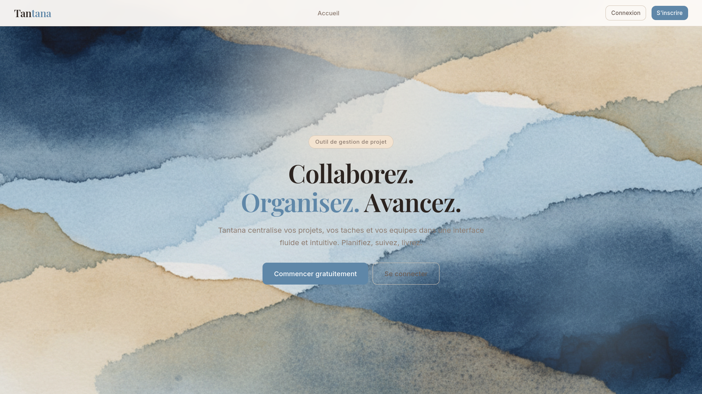
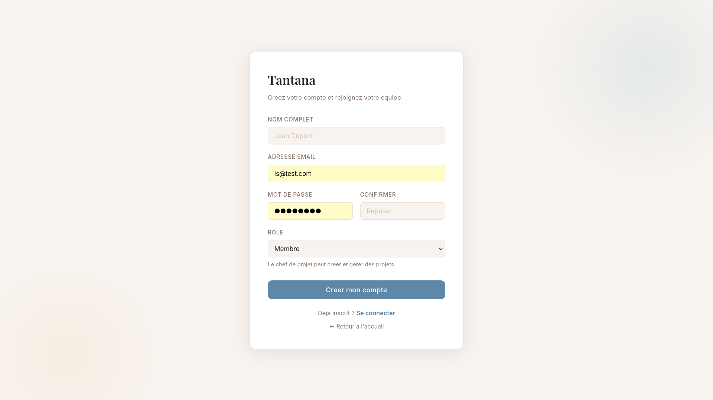
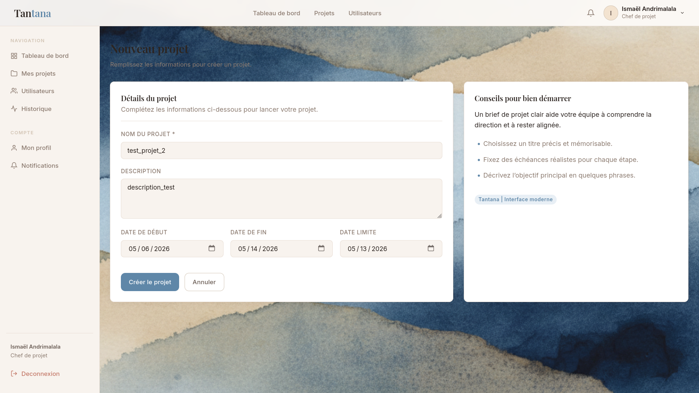
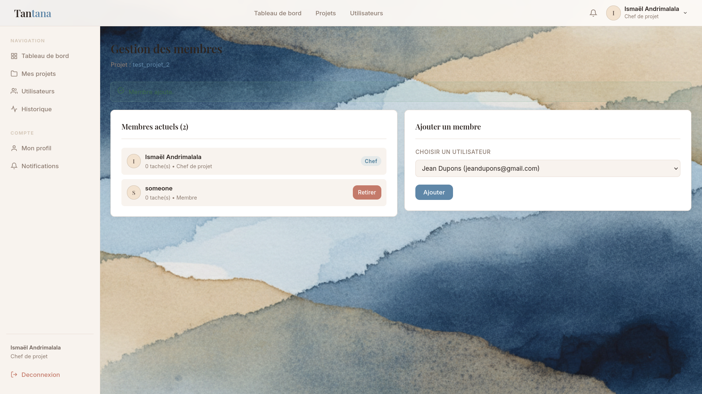

# tantana
*(plus de mise à jour pour l'instant, branche active: architecture/new-cdm)*

## Fonctionnalités CRUD disponibles

- Création de compte utilisateur  
- Modification des informations du compte utilisateur  
- Création, modification et suppression de projets  
- Assignation des membres à un projet  
- Création, modification et suppression des tâches  
- Assignation des utilisateurs aux tâches

## Installation et test en local

```bash
git clone https://github.com/Isma-Andri/tantana.git
cd tantana
php -S localhost:8000
```
Configurer la base de données dans `config/database.php`

## Screenshots 





